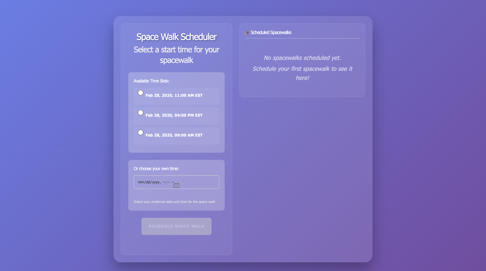
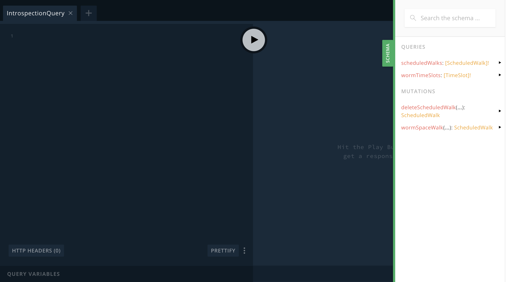

# Worms in Space

An application for worms to schedule space walks... in space. 

## **Features**

✅ **Interactive Space Walk Scheduler** - Schedule spacewalks using predefined time slots or custom date/time picker  

✅ **Database Persistence** - All scheduled spacewalks are saved to PostgreSQL and persist between sessions  

✅ **Real-time Sidebar** - View all scheduled spacewalks in a sidebar with the ability to cancel them  

✅ **GraphQL API** - Full GraphQL API with queries and mutations for spacewalk management  

✅ **Form Validation** - Input validation and error handling for scheduling  


## **To run the application:**

```bash
make launch

# Or, if rebuilding
make restart
```

**The application will automatically:**
1. Wait for PostgreSQL to be ready
2. Install dependencies 
3. Create the database (`worms_in_space_dev`)
4. Run migrations to create the `scheduled_walks` table
5. Start the Phoenix server

Once the application starts, you can visit [`localhost:4000`](http://localhost:4000) from your browser to view the application or [`localhost:4000/api`](http://localhost:4000/api) to play around with the GraphiQL Playground.

**[`localhost:4000`](http://localhost:4000) view:** 


**[`localhost:4000/api`](http://localhost:4000/api) view:** 



## **GraphQL API**

The application provides a full GraphQL API with the following operations:

### Queries
```graphql
# Get available predefined time slots
query {
  wormTimeSlots {
    id
    startTime
  }
}

# Get all scheduled spacewalks
query {
  scheduledWalks {
    id
    startTime
    walkType
    slotId
    status
    scheduledAt
  }
}
```

### Mutations
```graphql
# Schedule a spacewalk with predefined slot
mutation {
  wormSpaceWalk(id: "2") {
    id
    startTime
    walkType
    status
    scheduledAt
  }
}

# Schedule a spacewalk with custom time
mutation {
  wormSpaceWalk(alternateTime: "2024-02-28T16:00:00.000Z") {
    id
    startTime
    walkType
    status
    scheduledAt
  }
}

# Cancel a scheduled spacewalk
mutation {
  deleteScheduledWalk(id: "123") {
    id
    status
  }
}
```

## **Database Schema**

The application uses PostgreSQL with the following table:

```sql
CREATE TABLE scheduled_walks (
  id SERIAL PRIMARY KEY,
  start_time TIMESTAMP NOT NULL,
  walk_type VARCHAR(20) NOT NULL,
  slot_id VARCHAR(10),
  status VARCHAR(20) DEFAULT 'scheduled',
  inserted_at TIMESTAMP DEFAULT NOW(),
  updated_at TIMESTAMP DEFAULT NOW()
);
```

## **Architecture**

- **Frontend**: React 18 + TypeScript + Apollo Client
- **Backend**: Elixir/Phoenix + Absinthe (GraphQL)
- **Database**: PostgreSQL with Ecto ORM
- **Containerization**: Docker Compose
- **Styling**: Modern CSS with glassmorphism effects

## **Dependencies, Frameworks, Libraries**
* GraphQL

* Absinthe

* Apollo Client

* React

* Typescript

## **License**
This project is licensed under the MIT License - see the [LICENSE](LICENSE) file for details.

